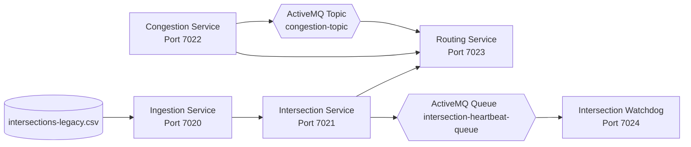
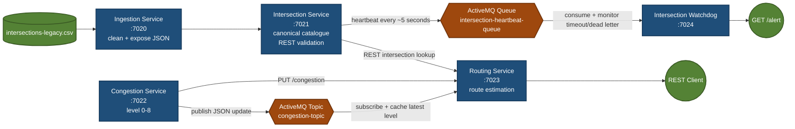

# TrafficFlow

## Overview

Urban traffic light control and congestion-based routing.

Domain entities: intersections, districts, signal types.

Every class in this repo lives in a single flat package, `co.wethinkcode.trafficflow`. TrafficFlow is built
as a small set of independent services, following a growth path from simple data
cleanup through synchronous REST calls to asynchronous MQ decoupling and alerting:

1. clean a messy legacy CSV export (`intersections-legacy.csv`) — handled by **IngestionServiceApp**
2. serve it up and act on it, via three REST services calling each other directly
   over HTTP
3. decouple the relevant services with an ActiveMQ topic (`congestion-topic`) instead of
   direct calls — shared broker setup lives in [`common/`](common)
4. raise the alarm on failure — handled by **IntersectionWatchdogApp**

| Service | Folder | Port | Role |
|---|---|---|---|
| IngestionServiceApp | [`ingestion-service/`](ingestion-service) | 7020 | Parses and cleans `intersections-legacy.csv` |
| IntersectionServiceApp | [`intersection-service/`](intersection-service) | 7021 | Validates intersection/district names (source of truth). |
| CongestionServiceApp | [`congestion-service/`](congestion-service) | 7022 | Tracks the city-wide Congestion Level (0-8). |
| RoutingServiceApp | [`routing-service/`](routing-service) | 7023 | Provides estimated travel times based on congestion and intersection. |
| IntersectionWatchdogApp | [`intersection-watchdog/`](intersection-watchdog) | 7024 | cries for help if the Intersection Service crashes, since routes can no longer be validated. |

Plus [`common/`](common) (no port) — the shared ActiveMQ broker and MQ config notes
for `congestion-topic`: Routing Service becomes aware of congestion changes via an ActiveMQ Topic instead of querying Congestion Service directly.

**Status:** All four stages are implemented. The services clean and share canonical intersection data, estimate routes from validated endpoints and congestion, distribute congestion changes through ActiveMQ, and surface intersection heartbeat alerts.

## Your task

Build out the four stages below, roughly in order — each stage builds on the last.
Stages 1-2 are the core exercise; stages 3-4 are stretch goals if you have time left.
Exact field names and response shapes are your call throughout — see
"Integration contracts" below for illustrative shapes, not a spec to match exactly.

| Stage | What | Required? | Rough effort |
|---|---|---|---|
| 1 | Clean `intersections-legacy.csv` in **IngestionServiceApp** and expose the cleaned records (see [`ingestion-service/README.md`](ingestion-service) for the specific data issues to handle) | Required | 1-2 hrs |
| 2 | Implement the domain endpoints in **IntersectionServiceApp**, **CongestionServiceApp**, and **RoutingServiceApp**, wired together with direct synchronous REST calls | Required | 2-3 hrs |
| 3 | Decouple Congestion → Routing with the `congestion-topic` ActiveMQ topic instead of a direct REST call (see [`common/README.md`](common)) | Stretch | 1 hr |
| 4 | Add heartbeat/dead-letter alerting in **IntersectionWatchdogApp** so it notices when the Intersection Service goes down | Stretch | 1 hr |

(Effort is a rough guide, not a hard budget — go with what feels right for your pace.)

## Integration contracts

Every place one service calls or messages another, with an illustrative shape.
None of these field names are binding — match the intent, not the exact JSON.

| From → To | Stage | Mechanism | Shape |
|---|---|---|---|
| ingestion-service → intersection-service | 1 | REST, `GET` | `GET /intersections` on ingestion-service (port 7020) → `200 OK` + JSON array of cleaned records, e.g. `[{"id": "INT-1001", "district": "Downtown", "signalType": "4-way", "active": true}, ...]`. intersection-service loads this as its canonical list. |
| routing-service → intersection-service | 2 | REST, `GET` | `GET /intersections/{id}` on intersection-service (port 7021) → `200 OK` with the record, or `404` if the id/district isn't recognized. routing-service calls this to validate a route's endpoints before estimating travel time. |
| routing-service → congestion-service | 2 | REST, `GET` | `GET /congestion` on congestion-service (port 7022) → `200 OK` + `{"level": 0-8}`. routing-service polls this per-request in stage 2. |
| congestion-service → routing-service | 3 | ActiveMQ Topic `congestion-topic` | Once stage 3 is in place, congestion-service publishes `{"level": 0-8}` to `congestion-topic` whenever the level changes, and routing-service subscribes instead of polling `GET /congestion`. Broker URL + topic name come from the shared `MqConfig` class — see [`common/README.md`](common). |
| intersection-service → intersection-watchdog | 4 | ActiveMQ Queue `intersection-heartbeat-queue` | intersection-service publishes a periodic heartbeat message to `intersection-heartbeat-queue`; intersection-watchdog consumes it and raises an alert (e.g. logs, or its own `/alert` state) if a heartbeat is missed or lands in the dead-letter queue. Queue name comes from the shared `MqConfig` class, same pattern as `congestion-topic` — see [`intersection-watchdog/README.md`](intersection-watchdog). |

## Project structure

```
trafficflow/
├── README.md
├── .gitignore
├── ingestion-service/          (port 7020)
│   ├── pom.xml
│   ├── README.md
│   └── src/main/
│       ├── java/co/wethinkcode/trafficflow/IngestionServiceApp.java
│       └── resources/intersections-legacy.csv
├── intersection-service/          (port 7021)
├── congestion-service/          (port 7022)
├── routing-service/          (port 7023)
├── common/
│   ├── docker-compose.yml
│   └── README.md
└── intersection-watchdog/          (port 7024)
```

## Architecture






## Build

Requirements: Java 17+, Maven 3.8+, Docker (for the broker in `common/`).

Every folder here (`ingestion-service/`, each domain service, and `intersection-watchdog/`) is
an **independent** Maven project — there is no parent/aggregator pom. Build one at a
time, e.g.:

```
cd intersection-service
mvn package
```

...or build every module in the repo in one pass from the project root:

```
find . -name pom.xml -execdir mvn -q package \;
```

## Run

The repository includes a root [`Makefile`](Makefile) to reduce repeated commands. From the project root, use:

```
make help
make test
make package
make verify
```

To use the Docker-based broker documented in `common/`:

```
make broker-start
```

Start each Java service in a separate terminal, in this order:

```
make run-ingestion
make run-intersection
make run-congestion
make run-routing
make run-watchdog
```

After all services are running, check their health endpoints with:

```
make health
```

The Makefile targets require GNU Make and are convenient in Git Bash, WSL, Linux, or macOS. On native Windows PowerShell, use the equivalent `mvn` and `java -jar` commands below. If you installed ActiveMQ Classic directly on Windows rather than using Docker, start it with `C:\Tools\apache-activemq-5.19.11\bin\activemq.bat start` instead of `make broker-start`.

The equivalent manual workflow is:

```
# Start the ActiveMQ broker first (required by stages 3 and 4)
cd common && docker compose up -d

# Start the services in separate terminals, in this order
cd ingestion-service && mvn package && java -jar target/ingestion-service.jar
cd intersection-service && mvn package && java -jar target/intersection-service.jar
cd congestion-service && mvn package && java -jar target/congestion-service.jar
cd routing-service && mvn package && java -jar target/routing-service.jar
cd intersection-watchdog && mvn package && java -jar target/intersection-watchdog.jar
```

| Service | Port |
|---|---|
| IngestionServiceApp (`ingestion-service`) | 7020 |
| IntersectionServiceApp (`intersection-service`) | 7021 |
| CongestionServiceApp (`congestion-service`) | 7022 |
| RoutingServiceApp (`routing-service`) | 7023 |
| IntersectionWatchdogApp (`intersection-watchdog`) | 7024 |

## Test

Each module has JUnit 5 unit tests. Run the complete suite from the project root:

```
find . -name pom.xml -execdir mvn test \;
```

For an HTTP smoke test after starting the services:

```
curl http://localhost:7020/intersections
curl http://localhost:7021/intersections/INT-1001
curl -X PUT http://localhost:7022/congestion \
  -H 'Content-Type: application/json' -d '{"level":4}'
curl -X POST http://localhost:7023/routes/estimate \
  -H 'Content-Type: application/json' \
  -d '{"originId":"INT-1001","destinationId":"INT-1002","baseMinutes":10}'
curl http://localhost:7024/alert
```
